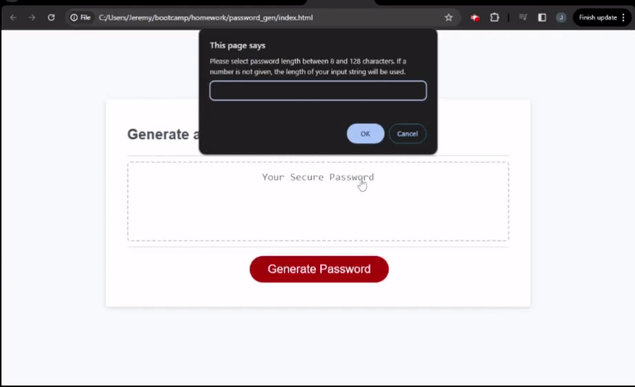

# password_gen

## Description
This is a simple password generator page based on some example code that we build during class with the guidance of JD, the instructor. The code from class gathers all the required character types into an array, and then selects characters from this array to build a password. Onto this, I added a password checking function that verifies that the password has all the required characters before returning it to the user. If the generated password does not contain all required character types, then it will run the password generator again until the password meets the requirements. 

Part of this homework was building in the interactivity of a user choosing their password length and character types, which is fun because it allows me as the programmer to put some personality into the prompts. I also had fun making sure all possible variations of input were accounted for, including not selecting anything.

## Usage
When you click the red button, you will be prompted for a password length, and you can either type a number or a series of characters. Then you will be asked, sequentially, if you would like lowercase letters, uppercase letters, numbers, and special characters in your password. If you do not select any character types, you will be asked again until you choose at least one character type. Once all the inputs are gathered, your randomly generated password will be returned in the text box.

## Mockup

## License
MIT License

## Tests
To  verify the application is working as intended, here are a few tests you can run:

- Input both numbers for the password length, as well as strings of the desired length. Inputing the number 10 or the string 'abcdefghij' should both result in a password that is 10 characters long.
- Select each data type when prompted should give a password that has uppercase, lowercase, numbers, and special characters.
- Select no data types, and you should be reprompted for each data type with a slightly different message. The second messages will repeat until at least one data type has been selected.
- When prompted for password length, hit cancel. You should be reprompted to input a password length, and canceling again will end the process and return undefined in the text box. The same thing will happen if you input an empty string each time.

## Badges

